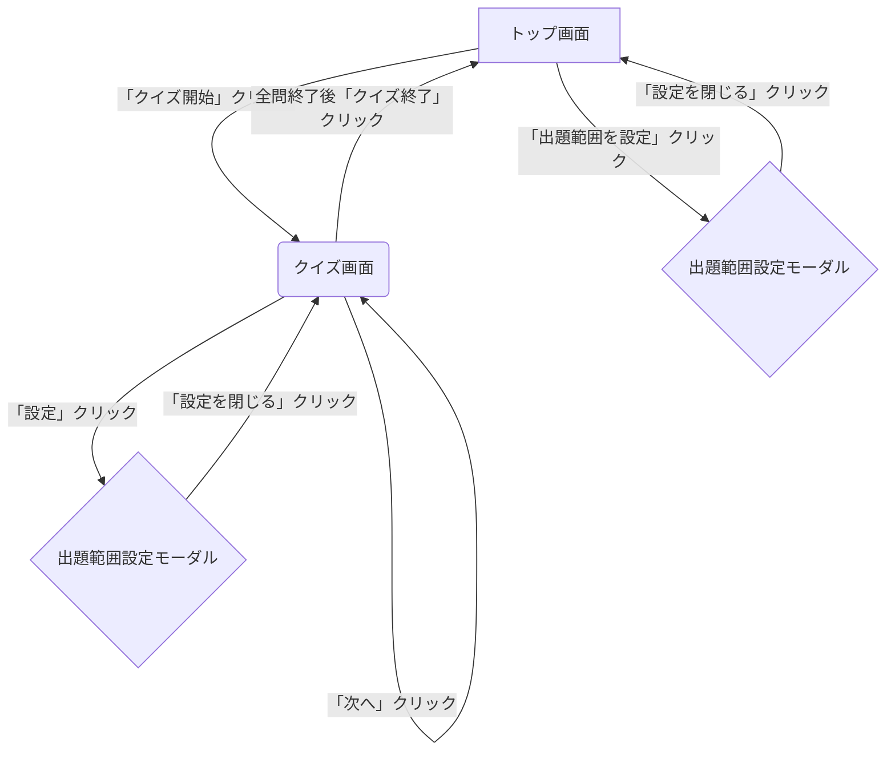

# 【要件定義書】中トロドン Webアプリケーション

# 1. 改訂履歴
| **版数** | **改訂日** | **改訂内容** | **作成者** |
|:-:|:-:|:-:|:-:|
| 1.3 | 2025/07/15 | モーダル機能実装、デフォルト再生時間設定機能追加 | Claude |
| 1.2 | 2025/07/15 | 出題範囲設定のモーダル化 | Claude |
| 1.1 | 2025/07/14 | 楽曲再生ロジック変更（durationを任意項目化） | Gemini |
| 1.0 | 2025/07/14 | 初版作成 | Gemini |

# 2. はじめに
### 2.1. 本書の目的
本書は、Webアプリケーション「中トロドン」の開発にあたり、その仕様、機能、および非機能要件を明確に定義することを目的とします。本書は、開発チーム、デザイナー、およびプロジェクト関係者間の共通認識を形成するための基礎資料となります。

### 2.2. プロダクト概要
「中トロドン」は、楽曲の中盤（サビやBメロなど）を聴いて曲名を当てる、新感覚の音楽クイズWebアプリケーションです。ユーザーは出題範囲を好きなアーティストのアルバム単位でカスタマイズでき、より深く音楽を楽しむ体験を提供します。

### 2.3. 開発の背景と目的
従来のイントロクイズとは一線を画し、楽曲の最も特徴的な部分から出題することで、アーティストのファンはより深く知識を試し、ライトな音楽ファンは新たな曲と出会うきっかけを得ることができます。友人や家族と手軽に楽しめるエンターテイメントを提供し、音楽を通じたコミュニケーションの活性化を目指します。

# 3. システム構成
### 3.1. 技術スタック
本アプリケーションは、以下の技術スタックで開発を行います。
| **カテゴリ** | **技術** | **バージョン/備考** |
|:-:|:-:|:-:|
| フレームワーク | Next.js | v15.3.5 (App Router) |
| 言語 | TypeScript | v5.5.0 |
| スタイリング | Tailwind CSS | v3.4.0 |
| テスティング | Jest | v29.7.0 |
| Linter/Formatter | Biome | v1.8.0 |
| パッケージ管理 | pnpm | v8.0.0以降 |

### 3.2. データ管理
* **楽曲データ:** アプリケーション内で使用する楽曲情報は、静的なJSONファイルで管理します。
* **データ構造:** 楽曲データは、アーティスト、アルバム、楽曲の階層構造で定義します。

songs.json の構造例:
```json
{
  "artists": [
    {
      "id": "artist001",
      "name": "アーティストA",
      "albums": [
        {
          "id": "album001",
          "name": "アルバムX",
          "jacketUrl": "https://example.com/jacketX.jpg",
          "tracks": [
            {
              "id": "track001",
              "title": "曲1",
              "youtubeUrl": "https://www.youtube.com/watch?v=xxxxxx"
            },
            {
              "id": "track002",
              "title": "短い曲2",
              "youtubeUrl": "https://www.youtube.com/watch?v=yyyyyy",
              "duration": 120,
              "midpointStart": 55
            }
          ]
        }
      ]
    }
  ]
}
```
* **duration (任意):** 曲の総再生時間（秒）。短い曲や特に長い曲など、再生開始位置の計算で標準と異なる考慮が必要な場合に**任意で設定**します。
* **midpointStart (任意):** 中盤再生の推奨開始時間（秒）。計算ロジックよりも優先して再生開始位置を固定したい場合に利用します。

# 4. 機能要件
### 4.1. 画面一覧・遷移図


### 4.2. 画面別要件定義
**4.2.1. トップ画面 (** / **)**
ユーザーが最初に訪れる画面。クイズの開始と、出題範囲・再生時間の設定を行います。

**UIコンポーネントと仕様:**
| **No.** | **UI要素** | **種別** | **説明** |
|:-:|:-:|:-:|:-:|
| 1 | アプリケーションロゴ | 画像/テキスト | 「中トロドン」のタイトルロゴと説明文を表示する。 |
| 2 | 出題範囲設定エリア | コンテナ | 出題範囲の設定状況を表示するエリア。 |
| 3 | 出題範囲設定ボタン | ボタン | 「出題範囲を設定」ボタン。クリックで出題範囲設定モーダル(No.4)を開く。 |
| 4 | 出題範囲設定モーダル | モーダル | アーティスト・アルバム選択と再生時間設定を行うモーダルウィンドウ。 |
| 5 | クイズ開始ボタン | ボタン | 「クイズ開始」ボタン。1つ以上のアルバムが選択されている場合に活性化する。 |

**4.2.2. クイズ画面 (** /quiz **)**
クイズをプレイするメイン画面です。

**UIコンポーネントと仕様:**
| **No.** | **UI要素** | **種別** | **説明** |
|:-:|:-:|:-:|:-:|
| 1 | 問題番号 | テキスト | 「Q. 1」「Q. 2」のように現在の問題番号を表示する。 |
| 2 | YouTube埋め込み | iframe | 楽曲再生用のYouTube iframe。**ユーザーには見えないように画面外に配置**し、音声のみを再生する。 |
| 3 | 再生ボタン | ボタン | アイコン（▶/❚❚）で再生/停止状態を示す。クリックで楽曲の中盤を指定時間再生/停止する。 |
| 4 | 再生時間選択 | プルダウン | 再生時間を「1秒」「1.5秒」「2秒」「3秒」「5秒」から選択できる。 |
| 5 | 答えを表示ボタン | ボタン | クリックすると、解答エリア(No.6)を表示する。一度クリックすると非活性化する。 |
| 6 | 解答エリア | コンテナ | **初期状態では非表示。**「答えを表示」ボタンクリックで表示される。以下の要素を含む。<br>・アルバムジャケット画像 (jacketUrl)<br>・曲名 (title)<br>・アーティスト名 (name)<br>・アルバム名 (name) |
| 7 | 次へボタン | ボタン | **初期状態では非活性。**「答えを表示」ボタンクリック後に活性化する。クリックすると次の問題へ進む。最後の問題では「クイズ終了」と表示される。 |
| 8 | 出題範囲設定ボタン | ボタン | 歯車アイコンのボタン。クリックすると出題範囲設定モーダル(No.9)を開く。 |
| 9 | 出題範囲設定モーダル | モーダル | トップ画面と同様のアルバム選択・再生時間設定機能を提供するモーダルウィンドウ。 |

**4.2.3. 出題範囲設定モーダル**
トップ画面・クイズ画面の両方から呼び出される共通のモーダルです。

**UIコンポーネントと仕様:**
| **No.** | **UI要素** | **種別** | **説明** |
|:-:|:-:|:-:|:-:|
| 1 | アーティスト選択 | プルダウン | songs.json からアーティスト一覧を動的に生成し、表示する。 |
| 2 | アルバム選択リスト | チェックボックスリスト | 選択されたアーティストのアルバム一覧をジャケット画像と共に表示する。各アルバムにチェックボックスを設け、出題対象を選択可能にする。 |
| 3 | 一括選択ボタン | ボタン | 「すべて選択」「すべて解除」の2つのボタンを配置し、表示されているアルバムを一括で選択/解除できる。 |
| 4 | 再生時間設定 | プルダウン | デフォルト再生時間を「未選択」「1秒」「1.5秒」「2秒」「3秒」「5秒」から選択できる。 |
| 5 | 設定を閉じるボタン | ボタン | モーダルを閉じるボタン。設定内容を保存する。 |

### 4.3. 共通機能要件
**4.3.1. 楽曲再生ロジック**
* **再生箇所の決定:**
  * **原則 (Default Rule):** songs.jsonの楽曲データにdurationの指定がない場合、多くの楽曲が平均4〜5分であることを想定し、**90秒から150秒の間**のランダムな整数秒を開始位置とします。
  * **例外 (Exception Rule):** 楽曲データにduration (曲の総再生時間) が指定されている場合、その曲の中盤部分を再生します。具体的な開始時間は、duration * 0.4 から duration * 0.6 の間のランダムな整数秒とします。この仕組みにより、極端に再生時間が短い、または長い楽曲にも柔軟に対応できます。
  * **優先事項 (Priority):** 楽曲データにmidpointStartが指定されている場合は、上記の計算ロジックよりも優先してその値を再生開始時間として使用します。

**4.3.2. 再生時間デフォルト設定機能**
* **デフォルト再生時間の設定:**
  * 出題範囲設定モーダルでデフォルト再生時間を設定可能。
  * 設定された場合：各問題でその秒数にリセットされる。
  * 未設定の場合：前の問題の再生時間設定が引き継がれる。
* **URLパラメータ連携:**
  * トップ画面からクイズ画面への遷移時に `defaultDuration` パラメータで設定を引き継ぎ。
  * 設定の永続化により、画面遷移後も設定が保持される。

**4.3.3. YouTube再生制御**
* YouTube IFrame Player API を利用して、再生、停止、シークを制御する。
* loadVideoById メソッドに startSeconds パラメータを指定して、決定された開始時間から再生を開始する。
* setTimeout を使用して、指定秒数後に pauseVideo を呼び出し、再生を停止する。
* プレイヤーは画面外に配置し、音声のみを再生する。

**4.3.4. 出題範囲設定機能**
* **アルバム選択:**
  * アーティスト単位でアルバムを選択可能。
  * 一括選択・解除機能を提供。
  * 選択されたアルバムの楽曲のみからクイズ問題を生成。
* **URLパラメータ連携:**
  * 選択されたアルバムを `albums` パラメータで管理。
  * 全アルバム選択時はパラメータを省略し、全楽曲から出題。

# 5. 非機能要件
| **項目** | **要件** |
|:-:|:-:|
| **ユーザビリティ (UI/UX)** | ・専門知識がなくても直感的に操作できる、シンプルで分かりやすい画面デザイン。<br>・スマートフォン、タブレット、PCなど、異なる画面サイズでも表示が崩れず、快適に操作できるレスポンシブデザインを採用する。<br>・モーダルウィンドウによる設定変更で、ユーザーの操作負荷を軽減する。 |
| **パフォーマンス** | ・画面遷移や楽曲データの読み込みが高速であり、ユーザーにストレスを与えないこと。<br>・特にクイズ画面での次問題への切り替えは1秒以内に完了することを目指す。<br>・YouTube Player APIの初期化を最適化し、再生遅延を最小限に抑制する。 |
| **セキュリティ** | ・YouTube IFrame Player APIのみを使用し、APIキーは不要。<br>・XSS攻撃を防ぐため、ユーザー入力の適切なサニタイズを実施。<br>・楽曲データは静的JSONファイルで管理し、セキュリティリスクを最小化。 |
| **運用・保守** | ・songs.json の更新（楽曲の追加・修正）が容易に行える構造であること。<br>・コードはリーダブルであり、他の開発者が容易にメンテナンスできること。<br>・TypeScriptによる型安全性を確保し、バグの発生を抑制。<br>・包括的なテストケースにより、機能の品質を保証。 |
| **テスト** | ・Jest + React Testing Libraryによる包括的なテストスイート。<br>・190個以上のテストケースで機能の品質を保証。<br>・統合テストによりエンドツーエンドの動作を検証。 |

# 6. 技術的実装詳細
### 6.1. 状態管理
* **React useState** による局所的な状態管理を採用。
* **URLパラメータ** により画面間の状態連携を実現。
* **カスタムフック** (useYouTubePlayer) でYouTube Player APIの状態を管理。

### 6.2. コンポーネント設計
* **機能別コンポーネント分割:** QuizPlayer、AlbumSelector、Modal等
* **型安全性:** TypeScriptによる厳密な型定義
* **再利用性:** 共通コンポーネントの積極的な活用

### 6.3. ファイル構造
```
src/
├── app/                 # Next.js App Router
├── components/          # 共通コンポーネント
├── hooks/              # カスタムフック
├── types/              # TypeScript型定義
├── utils/              # ユーティリティ関数
└── __tests__/          # テストファイル
```

# 7. 用語集
| **用語** | **説明** |
|:-:|:-:|
| 中トロドン | 本アプリケーションの名称。楽曲の中盤を聴いて曲名を当てるクイズ形式。 |
| 出題範囲 | クイズに出題される楽曲の集合。ユーザーがアルバム単位で選択する。 |
| セッション | ユーザーがトップ画面で「クイズ開始」をクリックしてから、全問終了するか離脱するまでの一連のプレイ。 |
| デフォルト再生時間 | 各問題開始時の再生時間初期値。設定可能で、未設定時は前問題の設定を引き継ぐ。 |
| モーダルウィンドウ | 出題範囲・再生時間設定を行うオーバーレイ表示の設定画面。 |
| URLパラメータ | 画面間の状態連携に使用するクエリパラメータ（albums、defaultDuration）。 |